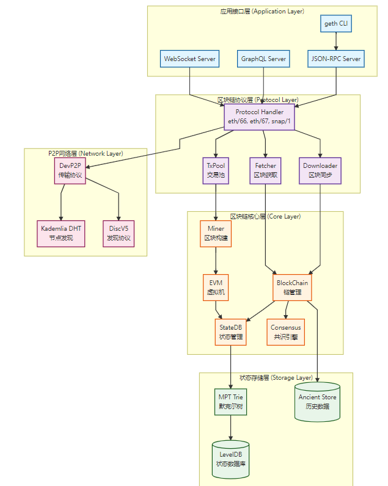

# Advanced_golang_task2
golang进阶打卡任务2-Geth源码理解

## 理论分析

1. 阐述Geth在以太坊生态中的定位

    Go-Ethereum (Geth) 是以太坊基金会的官方Go语言实现，是目前以太坊网络上最广泛使用的客户端，占据主网节点约75%的市场份额。作为以太坊协议的具体实现，Geth承担着区块链网络维护、交易执行、智能合约部署与调用等核心功能。

    Go-Ethereum（Geth）是以太坊基金会官方维护的参考实现客户端，使用Go语言开发。在以太坊生态系统中扮演以下关键角色：

    作为参考实现（Reference Implementation）

    定义以太坊协议的标准实现规范
    其他客户端（如Nethermind、Besu、Erigon）参照Geth实现进行兼容性验证
    最先实现以太坊改进提案（EIP）的新特性
    技术特点

    性能优势: Go语言的并发特性（goroutine）带来高效的并行处理能力
    跨平台支持: 支持Linux、Windows、macOS、ARM等多种平台
    完整功能: 同时支持全节点、轻节点、归档节点、快照节点等多种模式
    工具链完善: 提供geth、clef、bootnode、evm等丰富工具

2. 解析核心模块交互关系：

    2.1 区块链同步协议（eth/62,eth/63）-- 区块和交易数据同步

        eth/62,eth/63 这两个协议是以太坊P2P网络层的核心，负责节点之间的区块和交易数据同步。它们代表了从简单到复杂、从低效到高效的演进
        ETH/64, ETH/65, ETH/66：后续协议版本持续优化，主要改进集中在交易池交互和网络流量控制
        同步模式: Full Sync / Fast Sync / Snap Sync / Light Sync
        Snap Sync性能提升3-5倍（2-4小时同步主网）

    2.2 交易池管理与Gas机制

        Pending队列: 可执行交易（nonce连续）
        Queue队列: 等待交易（nonce有空隙）
        EIP-1559动态费用机制

    2.3 EVM执行环境构建

        基于栈的虚拟机（Stack, Memory, Storage）
        256种操作码，Gas计量
        9个预编译合约（密码学原语） 

    2.4 共识算法实现（Ethash/POS）

        PoW时期: Ethash（ASIC抗性DAG）
        PoS时期: Beacon链集成（Engine API）
        私有链: Clique PoA

## 架构设计

1. 绘制分层架构图（需包含以下层级）：

   [P2P网络层]->[区块链协议层]->[状态存储层]->[EVM执行层]

    
    
    应用接口层: 提供用户交互接口（CLI、RPC、GraphQL、WebSocket）

    区块链协议层: 处理 P2P 协议、区块同步、交易池管理

    区块链核心层: 实现区块链逻辑、状态管理、EVM 执行、共识验证

    状态存储层: 使用 MPT 树存储状态，LevelDB 持久化，Ancient Store 存历史数据

    P2P网络层: 实现节点发现（Kademlia DHT）和数据传输（DevP2P）

2. 说明各层关键模块：

   les（轻节点协议）
    
        仅下载区块头（<1GB存储）
        按需请求Merkle证明
        适合移动端与IoT设备

   trie（默克尔树实现）

        MPT结构: Leaf, Extension, Branch节点
        4种树: State, Storage, Tx, Receipt
        优化: SecureTrie, StackTrie, Pruning

   core/types（区块数据结构）

        Block: Header + Transactions + Uncles
        Transaction: Legacy / AccessList / DynamicFee / Blob
        Receipt: Status, Gas, Logs, Bloom Filter

## 实践验证

 1. 编译与运行 Geth 节点

 git clone https://github.com/ethereum/go-ethereum.git
cd go-ethereum
make geth

# 验证安装
./build/bin/geth version

开发模式使用Clique共识（PoA），无需挖矿，适合本地开发测试。

# 创建数据目录
mkdir -p geth-research/practical/dev-node

# 启动dev节点
geth --datadir ./geth-research/practical/dev-node \
     --dev \
     --http \
     --http.addr 0.0.0.0 \
     --http.port 8545 \
     --http.api "eth,net,web3,personal,admin,miner,debug,txpool" \
     --http.corsdomain "*" \
     --ws \
     --ws.addr 0.0.0.0 \
     --ws.port 8546 \
     --ws.api "eth,net,web3" \
     --allow-insecure-unlock \
     --dev.period 0  # 0=仅在有交易时出块，1+=定时出块

参数说明:

--dev: 开发模式，自动创建测试账户并预分配以太币
--http: 启用HTTP-RPC服务器
--http.api: 暴露的API模块
--ws: 启用WebSocket服务器
--allow-insecure-unlock: 允许HTTP解锁账户（仅开发用）
--dev.period: 出块间隔（秒）

2. 控制台验证功能
在另一个终端，连接到dev节点：
geth attach http://localhost:8545

> eth.blockNumber
0
eth.sendTransaction({
    from: eth.accounts[0],
    to: eth.accounts[1],
    value: web3.toWei(10, "ether")
  })
> eth.blockNumber
1

3. 私有链搭建示例

创建 genesis.json

{
  "config": {
    "chainId": 1515,
    "clique": {"period": 15, "epoch": 30000}
  },
  "difficulty": "1",
  "gasLimit": "8000000",
  "alloc": {
    "0xYourAddress": { "balance": "1000000000000000000000" }
  }
}

初始化与启动：

./build/bin/geth --datadir ./privchain init genesis.json
./build/bin/geth --datadir ./privchain --http console

4. 智能合约部署示例

SimpleStorage.sol：

// SPDX-License-Identifier: MIT
pragma solidity ^0.8.0;
contract SimpleStorage {
    uint256 public x;
    function set(uint256 _x) public { x = _x; }
}

编译：

solc --optimize --bin --abi SimpleStorage.sol -o build

部署：

var abi = JSON.parse(cat('build/SimpleStorage.abi'));
var bin = '0x' + cat('build/SimpleStorage.bin');
personal.unlockAccount(eth.accounts[0], "password", 600);
var contract = eth.contract(abi);
var tx = contract.new({from:eth.accounts[0], data:bin, gas:3000000}, function(err,res){
  if(res.address){console.log('Deployed at', res.address);}
});

5.  区块浏览器验证

> eth.getBlock('latest')
> eth.getTransactionReceipt("0xTxHash")

## 研究报告

 1. 功能架构图交易生命周期流程图

用户签名交易 → 通过 RPC 提交到 Geth。

Geth 校验签名与 nonce → 放入 txpool。

P2P 网络广播交易。

矿工 / 共识客户端打包交易 → 调用 core.ApplyTransaction。

EVM 执行 → 更新 StateDB → 生成 Receipt。

状态 Trie 更新，计算新的 stateRoot。

新区块广播至全网 → 其他节点验证并同步

2. 账户状态存储模型

每个账户的数据结构：

Account = {
  nonce: uint64,
  balance: uint256,
  storageRoot: hash,
  codeHash: hash
}

状态存储：

世界状态由 Merkle-Patricia Trie 表示。
每个合约账户的 storageRoot 指向另一棵存储 trie。
所有账户的根哈希 stateRoot 存入区块头中。

